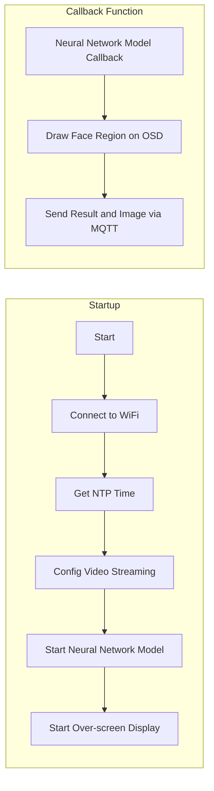

# Edge-Computing-Facial-Recognition
This is a project combine a Edge-Computing facial recognition system on Realtek AMB82 board and a Web server based on Django framework. Demonstrating real-time facial recognition and send the recognition result to database (AWS EC2 or SQLite).
The Realtek AMB82 runs on Arduino framework, using a pre-trained neural networks model (provided by Realtek).

# System Diagram

# Structure
Edge-Computing-Facial-Recognition/
├─ firmware/
│  └─ access_control/ 
|     └─ access_control.ino
|─ web/
│  |─ cms/ 
|  |    └─ static/ 
|  |    └─ templates/
|  |    └─ __init__.py
|  |    └─ admin.py
|  |    └─ apps.py
|  |    └─ forms.py
|  |    └─ models.py
|  |    └─ tests.py
|  |    └─ urls.py
|  |    └─ views.py
│  |─ manage.py
│  |─ dependency.md
|  └─ form_template.md
└─ README.md  

# Startup
## Embedded (AMB82)
1. Install Arduino IDE
2. Install Realtek AMB82 dependency
3. Connect AMB82 EVB using USB
4. Select Port
5. Click "Verify"
6. Click "Upload"

## Django
1. Open WSL (My environment: WSL with Ubuntu 20.04)
2. Install dependency (From dependency.md) 
3. `cd web`
4. `python3 manage.py runserver 0.0.0.0:8000`
5. Use web browser to connect to 0.0.0.0:8000

## Result